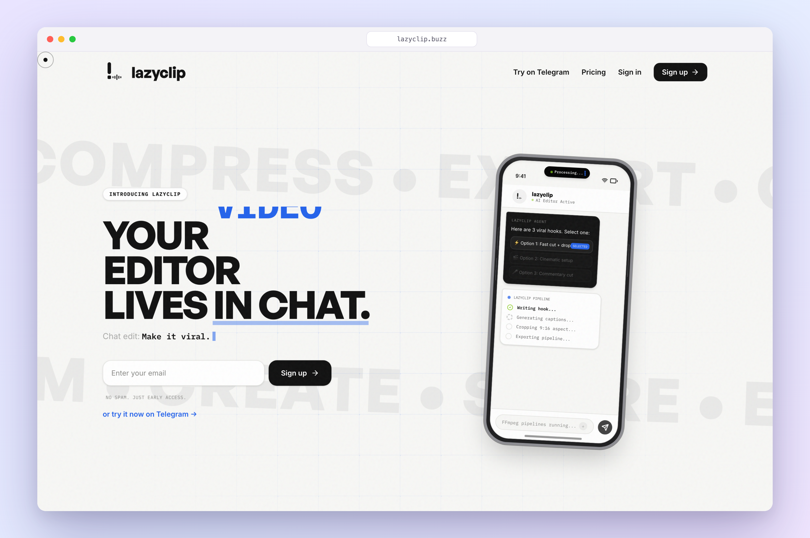
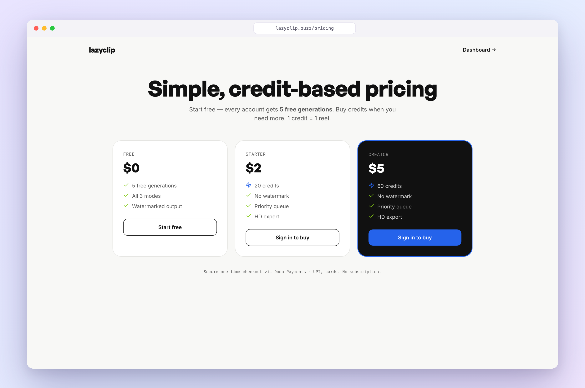
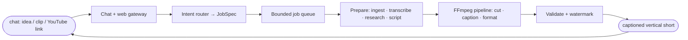

<div align="center">

# 🎬 LazyClip

### Your video editor lives in chat.

Turn a prompt, a raw clip, or a YouTube link into a captioned vertical short, just by asking.
No CapCut, no timeline, no converter sites.

[](https://lazyclip.buzz)
[](https://t.me/Lazy_clip_bot)


</div>



---

## The idea

Editing a short-form video is death by a thousand tabs: CapCut to trim, one site to convert, another to caption, a third to make a sticker, minutes of uploading and downloading for a 15-second clip. Meanwhile the hardest part isn't even the editing; it's **knowing what to make.**

**LazyClip collapses all of it into a chat.** You talk to it like you'd talk to an editor friend:

> *"make a 15s reel on why UPI beat credit cards"*
> *"clip 2:30-3:15 from this YouTube link and caption it"*
> *"make this vertical with a watermark"*

…and it hands back a finished, captioned, vertical video in seconds. It lives where you already are, on **Telegram** and the **web**, so there's nothing to install.

Why it works: it removes *both* points of friction at once: the blank page (it brainstorms and scripts for you) **and** the busywork (it cuts, captions, and formats for you). One surface, one message, one reel out.

## See it

| Landing | Pricing |
|---|---|
| Chat-native hero + live demo | Credit-based, start free |



The site is live at **[lazyclip.buzz](https://lazyclip.buzz)**, and the bot is live at **[@Lazy_clip_bot](https://t.me/Lazy_clip_bot)**. Send it a YouTube link and try it right now.

## Three modes, one engine

Every mode runs through the same pipeline: the words are generated, and ffmpeg does the cutting.

| Mode | You send | You get |
|------|----------|---------|
| 🧠 **Generate** | a topic | a brainstormed, scripted, voiced **14-20s reel** with captions |
| ✂️ **Edit** | a clip + an instruction | trimmed, captioned, reformatted, or converted output |
| 📎 **Clip** | a YouTube link + timestamps | only that segment, captioned and vertical |

## How it works



A conversational request is turned into a typed **JobSpec**; a bounded queue applies concurrency and resource limits; ffmpeg performs every media operation; the output is validated before delivery. YouTube ingestion downloads only the requested segment, and user text is never executed as a shell command.

## Built with Codex

LazyClip went from **idea to live product on its own domain** using an **agent-driven workflow**: I drove [OpenAI **Codex**](https://openai.com/codex/) as the primary builder rather than hand-writing each file.

How I used Codex:

- **Scaffolding & features:** Codex generated the Vite/React marketing site, the interactive iPhone demo, and the dashboard/pricing flows from high-level product prompts, iterating on design and copy in tight loops.
- **The media agent:** Codex built the TypeScript pipeline (`backend/`): the ffmpeg operation library, yt-dlp segment ingestion, Whisper transcription, script/caption generation, the bounded job queue, and the Telegram gateway, mapping natural-language requests to a **fixed, validated operation schema** so nothing user-typed ever hits a shell.
- **Wiring the platform:** Convex (data, waitlist, credits, generation queue), Clerk (Google auth), Resend (welcome email), PostHog (analytics), and Vercel (deploy) were integrated agentically, one concern at a time.
- **Parallel agents:** the frontend, backend agent, and infra were built in **parallel Codex sessions**, each committing to the same repo, which is why the whole thing came together in a single build sprint.

The result is a codebase designed to run predictably on a modest CPU-only host, with local fallbacks for every external integration so the core pipeline works without any API keys.

## Technology

| Component | Responsibility |
|---|---|
| **React + Vite + Tailwind** | Marketing site, dashboard, pricing |
| **TypeScript** | Typed orchestration + service contracts |
| **FFmpeg / yt-dlp / Whisper** | Media ops, segment ingest, transcription |
| **Convex** | Waitlist, users, credits, generation queue |
| **Clerk** | Google sign-in |
| **ElevenLabs / Linkup** | Voice-over + source-backed research |
| **Resend / PostHog** | Welcome email + product analytics |
| **Telegram + Google Cloud** | Chat gateway + rendered-reel storage |

## Run it locally

```bash
# product site
npm install
npm run dev            # http://localhost:5173

# media agent
cd backend
npm install
npm test
npm run reely -- "clip https://youtu.be/aqz-KE-bpKQ 0:02 to 0:06"
```

Copy `.env.example` → `.env.local` (root) and `backend/.env.example` → `backend/.env`, then fill in keys. Every integration has a local fallback, so the pipeline runs even without them.

## Documentation

- [Architecture](./docs/ARCHITECTURE.md) · [Setup](./docs/SETUP.md) · [Testing](./docs/TESTS.md) · [Demo](./docs/DEMO.md) · [Plan](./docs/PLAN.md)

## License

MIT. See [LICENSE](./backend/LICENSE).
