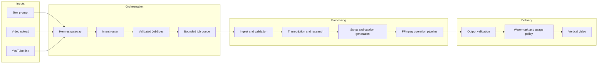
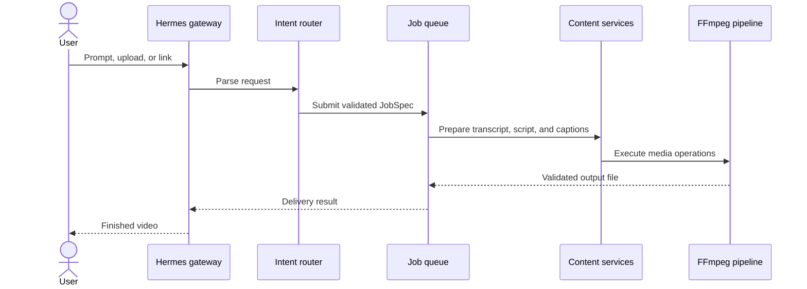

# Reely

Reely is an open-source video editing system controlled through natural-language instructions. It accepts a prompt, an uploaded video, or a YouTube segment and returns a processed vertical video with captions, formatting, and optional voice-over.

The repository contains two applications:

- `backend/` — the TypeScript media-processing service and chat agent
- repository root — the React product site and interactive editor demonstration

## Architecture



The gateway converts a conversational request into a typed `JobSpec`. The queue applies concurrency and resource limits before the job reaches the media pipeline. FFmpeg performs all media operations; generated text, captions, transcription, and research are prepared before rendering. The finished file is validated before it is returned to the user.

### Request lifecycle



## Product workflow

Reely supports three workflows through the same processing pipeline.

| Workflow | Input | Processing | Output |
| --- | --- | --- | --- |
| Generate | Topic or brief | Research, script, voice-over, captions, and composition | 14–20 second vertical video |
| Edit | Uploaded footage and an instruction | Transcription, trimming, captions, formatting, or conversion | Edited video, audio file, thumbnail, or GIF |
| Clip | YouTube URL and time range | Segment download, transcription, captions, and vertical formatting | Captioned short-form video |

## Technical design

The backend is designed to run predictably on a modest CPU-only host.

- All natural-language requests map to a fixed operation schema; user text is never executed as a shell command.
- Global concurrency is bounded and each user can run only one active job at a time.
- Uploads are limited by file size, duration, and resolution.
- Every job receives an isolated temporary directory that is removed after delivery.
- YouTube ingestion downloads only the requested segment.
- FFmpeg processes are time-limited and terminated when a job exceeds its budget.
- External integrations have local fallbacks so the core pipeline can run without API keys.

The test suite covers routing, queue behaviour, input validation, media operations, failure handling, and end-to-end generation. See [docs/TESTS.md](./docs/TESTS.md) for the detailed test plan.

## Technology

| Component | Responsibility |
| --- | --- |
| Hermes | Agent runtime and chat gateway |
| TypeScript | Typed orchestration and service contracts |
| FFmpeg | Video, audio, caption, format, and image processing |
| yt-dlp | Time-bounded YouTube ingestion |
| Whisper | Speech transcription |
| ElevenLabs | Generated voice-over |
| Linkup | Source-backed research for generated scripts |
| Convex | User, job, and usage data |
| React and Vite | Product site and interactive demonstration |

## Repository structure

```text
.
├── backend/
│   ├── src/
│   │   ├── content/       Script and caption generation
│   │   ├── data/          Persistence and usage policy
│   │   ├── gateway/       Chat integration
│   │   ├── ingest/        Upload and YouTube validation
│   │   ├── media/         FFmpeg operation library
│   │   ├── queue/         Bounded job execution
│   │   ├── router/        Natural language to JobSpec
│   │   ├── search/        Research integration
│   │   └── transcribe/    Speech-to-text integration
│   └── fixtures/          Media test fixtures
├── docs/                  Architecture, setup, test, and demo notes
├── src/                   React product site
└── convex/                Application data functions
```

## Running the project

### Product site

```bash
npm install
npm run dev
```

### Media service

```bash
cd backend
npm install
npm run typecheck
npm test
```

Run a workflow from the command line:

```bash
npm run reely -- "why UPI adoption grew in India"
npm run reely -- "make it vertical with a watermark" fixtures/sample.mp4
npm run reely -- "clip https://youtu.be/aqz-KE-bpKQ 0:02 to 0:06"
```

Optional integrations and environment variables are documented in [docs/SETUP.md](./docs/SETUP.md).

## Documentation

- [Architecture](./docs/ARCHITECTURE.md)
- [Setup](./docs/SETUP.md)
- [Testing](./docs/TESTS.md)
- [Demo guide](./docs/DEMO.md)
- [Implementation plan](./docs/PLAN.md)

## License

Reely is available under the [MIT License](./backend/LICENSE).
