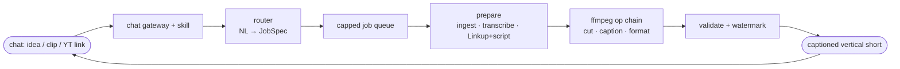
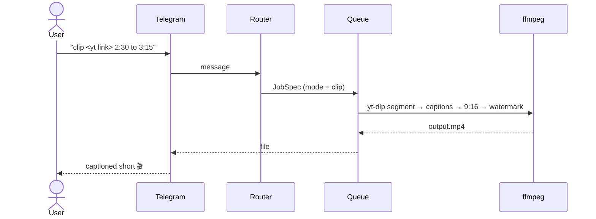

<div align="center">

# 🎬 reely

**A content studio that lives in your chat.**
Send an idea, a raw clip, or a YouTube link, get back a captioned vertical short.
The agent writes the words, ffmpeg cuts the video. No CapCut, no converter sites, no prompts.

[](https://github.com/JAYATIAHUJA/reely/actions/workflows/ci.yml)


</div>

---

## Why

You know the drill. Trim a clip in CapCut. Convert on one site. Caption on another. Make a sticker on a third. Minutes of uploading and downloading for one 15-second reel.

**reely does all of it in a chat**: talk to it like you'd talk to an editor friend, and get the finished short back in seconds.

## Three modes, one engine

| Mode | You send | You get |
|------|----------|---------|
| 🧠 **Generate** | a topic (*"why UPI beat credit cards"*) | the agent brainstorms a viral angle, grounds it in **live facts** (Linkup), voices it (ElevenLabs), returns a **14-20s reel** |
| ✂️ **Edit** | a raw clip + *"caption it, make it vertical"* | transcribed (Whisper), captioned, formatted 9:16, or turned into a sticker |
| 📎 **Clip** | a YouTube link + *"2:30 to 3:15"* | yt-dlp grabs **only that segment** → a captioned vertical short |

They all collapse to the same core: **The agent generates the words, ffmpeg burns them onto video.**

## How it works



<details>
<summary><b>A single request, end to end</b></summary>


</details>

## Quickstart

```bash
npm install
npm run build        # tsc, clean
npm test             # 65 tests, all green

# run any mode from the terminal (no agent runtime/Telegram/keys needed):
npm run reely -- "why UPI beat credit cards in india"                     # generate
npm run reely -- "make it vertical with a watermark" fixtures/sample.mp4  # edit
npm run reely -- "clip https://youtu.be/aqz-KE-bpKQ 0:02 to 0:06"         # clip (yt-dlp)
```

Each prints the path to a real **1080×1920** `.mp4`. To run the live Telegram bot: set
`TELEGRAM_BOT_TOKEN` in `.env` and `npm run gateway`. Full setup → [SETUP.md](../docs/SETUP.md).

## Built on (every integration does real work)

| Tool | Role |
|------|------|
| **Agent runtime** | what users talk to: gateway, skill routing, content generation |
| **ffmpeg** | every cut/caption/format/convert, no Remotion, no GPU |
| **yt-dlp** | segment-only YouTube download (Mode 3) |
| **Whisper** | transcription for captions (Modes 2 & 3) |
| **ElevenLabs** | voiceover (Mode 1) |
| **Linkup** | live web facts that ground generated reels |
| **Convex** | jobs / users / usage state |
| **Cloudflare** | landing page + file delivery |
| **Dodo** | ₹99 one-time unlock (drops the watermark) |

Every integration has an **offline fallback**, so the app runs with zero keys (templated scripts, macOS `say` voice, caption bar), you add keys to level up.

## Won't fall over

reely is **ffmpeg-first with a capped job queue**: the design that keeps one modest VPS alive under a viral spike:

- global concurrency = `cores − 1`, **one active job per user**, queue-depth reject
- hard per-job limits: **≤50 MB · ≤5 min · ≤1080p · 60-120s timeout** (aborts the running ffmpeg)
- unique temp dir per job, **deleted after send**; YouTube fetches **only the requested segment**
- inputs read with `-protocol_whitelist file` (SSRF guard); the NL maps to a **fixed op schema**, never a shell string

All of the above is covered by tests, including a 12-job concurrency load test. See [TESTS.md](../docs/TESTS.md).

## Project structure

```
src/
├─ types.ts        # frozen contracts (Op, JobSpec, module interfaces)
├─ router/         # NL → validated JobSpec
├─ queue/          # capped executor (concurrency, timeout, cleanup)
├─ media/          # ffmpeg op library + caption builders
├─ ingest/         # yt-dlp segment download + upload validation
├─ transcribe/     # Whisper client
├─ content/        # brainstorm / script / captions (LLM)
├─ search/         # Linkup live-facts grounding
├─ data/           # persistence + Dodo webhook
├─ gateway/        # chat gateway / Telegram binding
├─ app.ts          # integration (prepare + wiring)
└─ cli.ts          # terminal harness
convex/  web/  fixtures/
```

## Docs

| | |
|---|---|
| [ARCHITECTURE.md](../docs/ARCHITECTURE.md) | stack, contracts, executor pipeline, safety rules |
| [PLAN.md](../docs/PLAN.md) | phased build plan (parallel-agent friendly) |
| [SETUP.md](../docs/SETUP.md) | run it locally + manual steps (keys, agent runtime, deploy) |
| [DEMO.md](../docs/DEMO.md) | 2-minute stage script + proof + Q&A |
| [TESTS.md](../docs/TESTS.md) | layered testing plan + known gaps |

## Roadmap

- [ ] Auto-compress output to fit per-platform send limits (WhatsApp 16 MB / Discord 25 MB / Telegram 50 MB)
- [ ] Tailored errors for private / age-restricted / live YouTube videos
- [ ] yt-dlp rate-limit backoff + cookies
- [ ] WhatsApp gateway (Telegram ships first)

## License

MIT. See [LICENSE](./LICENSE).
